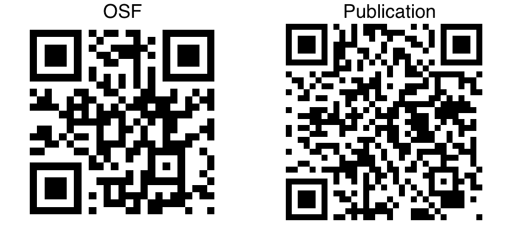

```{css, echo=FALSE}
div.logo_left{
  width: 25%;
}
div.poster_title{
  width: 50%;
}

div.logo_right{
  width: 25%;
}
```

```{r setup, include=FALSE}
# Enhanced package management and error handling
required_packages <- c(
  "tidyverse", 
  "knitr", 
  "kableExtra", 
  "png", 
  "grid"
)

# Package loader with installation
package_loader <- function(packages) {
  for (pkg in packages) {
    if (!requireNamespace(pkg, quietly = TRUE)) {
      install.packages(pkg, dependencies = TRUE)
    }
    library(pkg, character.only = TRUE, quietly = TRUE, warn.conflicts = FALSE)
  }
}

# Load packages
suppressPackageStartupMessages(package_loader(required_packages))

# Knitr options for consistent output
knitr::opts_chunk$set(
  echo = FALSE, 
  warning = FALSE, 
  message = FALSE,
  fig.align = 'left',
  out.width = '100%',  
  out.height = '100%',  
  # fig.width = 30,      
  # fig.height = 22,     
  dpi = 300,
  dev = c('pdf', 'png')
)
```

# Background

-   Autistic people show reduced social motor synchrony (SMS) when interacting with non-autistic and autistic partners [@georgescu_reduced_2020].
-   The Double Empathy Problem (DEP) suggests autistic social differences stem from bidirectional misunderstandings, not deficits [@milton_ontological_2012].
-   Limited research on how autistic individuals experience SMS and its rapport relationship.

In this registered report [@efthimiou_social_2025], we explored whether:

1.  SMS levels differ across autistic-autistic, mixed neurotype, and non-autistic dyads.
2.  How does SMS relate to self-reported rapport?
3.  Do non-autistic participants rely more on synchrony for rapport?

# Methods

-   Eighty-six participants (44 dyads) were assigned to one of three dyad types: autistic, non-autistic, or mixed (one autistic and one non-autistic).
-   After the interaction, participants completed a self-report rapport measure (ease, enjoyment, success, friendliness, and awkwardness) using a 100-point visual analogue scale; scores were summed and Z-transformed.
-   SMS was quantified using Motion Energy Analysis [@ramseyer_motion_2020].

```{r participant-table}
# Robust table generation with error handling
tryCatch({
  participant_data <- data.frame(
    Group = c("Autistic", "Non-autistic", "Total"),
    N = c(38, 48, 86),
    `Mean<br>Age` = c(31.4, 29.8, 30.5),
    `SD<br>Age` = c(8.2, 7.5, 7.9),
    Gender = c("21F, 17M", "27F, 21M", "48F, 38M"),
    check.names = FALSE
  )
  
kable(
  participant_data, 
  caption = "Participant Demographics", 
  format = "html",
  booktabs = TRUE,
  escape = FALSE
) 
}, error = function(e) {
  warning("Error creating participant table: ", e$message)
  kable(participant_data, escape = FALSE)
})
```

#### 

```{r experimental-setup, fig.cap='Screenshot of the ROI in the MEA software illustrating participants’ seating positions (left/right) and coloured ROIs.', out.height='70%', out.width='70%', fig.align='center'}

# Safe graphics inclusion
safe_graphics_include <- function(filename) {
  tryCatch({
    if (file.exists(filename)) {
      include_graphics(filename)
    } else {
      warning(paste("File not found:", filename))
      grid.text("Image Not Available", gp = gpar(fontsize = 20, col = "red"))
    }
  }, error = function(e) {
    warning("Graphics inclusion error: ", e$message)
    grid.text("Image Loading Error", gp = gpar(fontsize = 20, col = "red"))
  })
}

include_graphics("fig1.png")
```

# Results

```{r SMS-levels, fig.cap='Distribution of SMS scores by dyad neurotype (nonautistic, mixed, and autistic). The half-violin plots display the density distribution of SMS for each group. Boxplots indicate the interquartile range and median for each group. Individual data points are coloured black, and the grey dot represents the mean SMS for each neurotype.'}

safe_graphics_include("fig2.png")
```

A one-way ANOVA (*F*(2, 40) = 0.09, *p* = .91, *η²* = .005) revealed no significant differences in SMS between autistic, mixed, and non-autistic neurotype dyads (H1 not supported). This contrasts with prior research suggesting lower SMS in autistic interactions and indicates that autistic individuals synchronise at similar levels to non-autistic individuals.

```{r SMS-rapport, fig.cap='Relationship between SMS and Rapport across different neurotypes. Note. The plot shows regression lines shaded with standard error bands (ribbons) around the fitted lines for Autistic (blue), Mixed (orange), and Non-autistic (black) dyads.', out.height='70%', out.width='100%', fig.align='left'}

safe_graphics_include("fig3.png")
```

A linear mixed-effects model indicated that while SMS did not overall significantly predict rapport, non-autistic dyads exhibited a significantly steeper positive relationship compared with autistic dyads (*Mdiff* = 4.14, *SE* = 1.90, *t*(39) = 2.176, *p* = .036, CI [0.29, 7.98]). This suggests that non-autistic individuals might rely more on SMS for social bonding.

A one-tailed t-test revealed that the non-autistic group (*M* = 0.73, *SD* = 0.18) had significantly higher ratio scores than the autistic group (*M* = 0.65, *SD* = .21; *t*(84) = 2.04, *p* = .022, Cohen’s *d* = 0.45). This finding suggest that autistic and non-autistic individuals engage in rapport-building via different mechanisms.

# Key Findings

1.  Autistic individuals did not show reduced SMS.
2.  Non-Autistic Dyads showed a stronger positive relationship between SMS and Rapport, than Autistic Dyads.
3.  Findings support the Double Empathy Problem, suggesting different communication strategies.

# Discussion

Our findings indicate that while autistic individuals synchronise at levels comparable to non-autistic individuals, the relationship between SMS and rapport is significantly stronger in non-autistic dyads. This suggests that social bonding in non-autistic groups is more dependent on SMS, potentially due to an over-reliance on such cues, whereas autistic individuals may rely on alternative mechanisms.

# Link to OSF and Paper

```{r qr-code, fig.align='center', out.height='70%', out.width='70%'}
# Include the OSF QR code image

```

# References {style="body {   font-size: 1rem; /* 1rem is relative to the root element, often equivalent to 16px by default */ }"}
